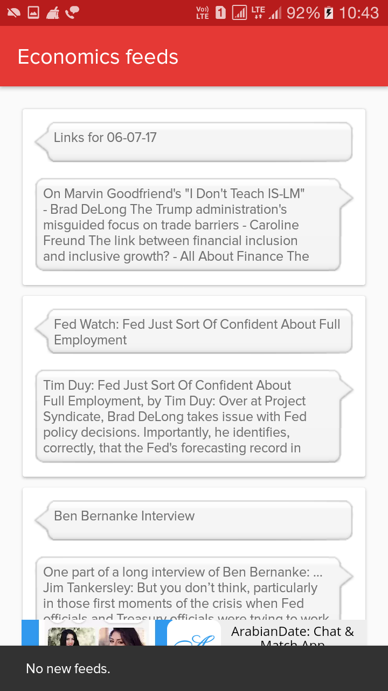
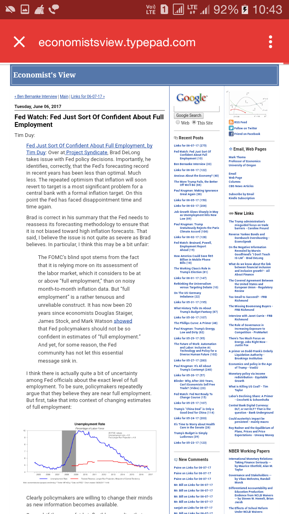

# Drona 

An android app that helps an MBA student/grad or any other management guy to keep up with the current trends in management.

| Topics screen                  | Feeds screen                      | View url screen                  |
|:------------------------------:|:---------------------------------:|:--------------------------------:|
| |  | |

## What the app does?
  Simply put the app aggregates rss feeds of management topics from various sites listed below. If you want to add a site or category, open a pull request.

## Credits
  This app aggregates rss feeds various sources.
  Categories and the respective feed sources are given below.

### Marketing
* [Ducttapemarketing](http://feeds2.feedburner.com/ducttapemarketing/nRUD)

### Finance
* [Prof. Jayanth Varma financial markets blog](https://faculty.iima.ac.in/~jrvarma/blog/index.cgi/index.rss)
* [NYtimes](http://rss.nytimes.com/services/xml/rss/nyt/Business.xml)

### Economics
* [The economists view](http://feeds2.feedburner.com/EconomistsView)
* [The money illusion](http://feeds2.feedburner.com/Themoneyillusion)

### Leadership
* [All things workplace](http://feeds2.feedburner.com/allthingsworkplace)

### Others
* [MIT](http://feeds2.feedburner.com/mitsloannews)
* [Kellog institute of management](http://www.kellogg.northwestern.edu/news-events/news/school/kellogg_news_feed.aspx)

## TODO
- [x] Progress bar for reader activity
- [x] Add about section
- [x] Add share option in reader activity
- [x] Integrate ads
- [x] Integrate firebase notifications
- [x] Style down cards in feeds display
- [x] Notify new app updates
- [ ] Option to add new feeds.
- [ ] Crashlytics
- [x] cache implementation
- [ ] background check for new feeds and notify user

## License
  MIT.
